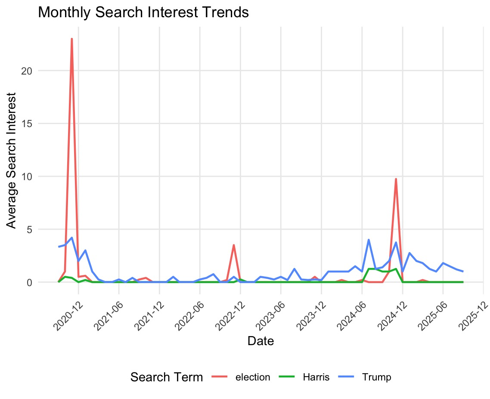
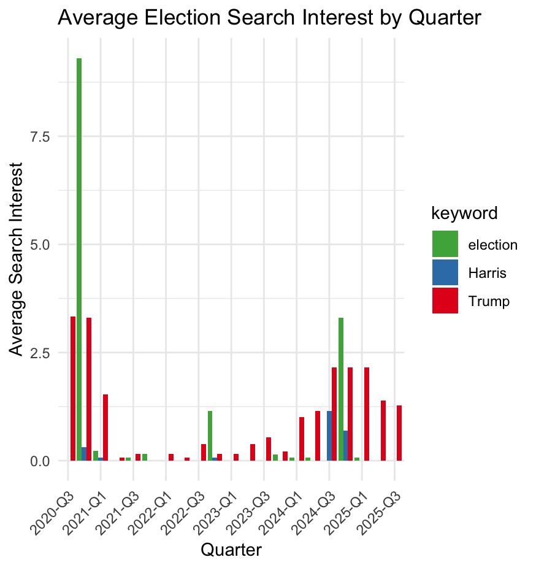
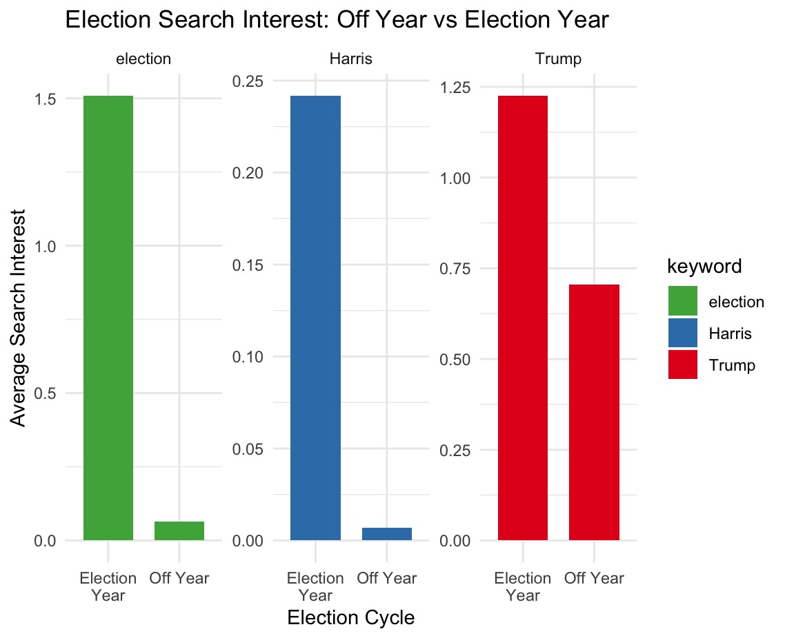

This is my analysis using Gtrend R package on the Google trends data using the keywords: Trump, Kamala Harris, and Election. The following charts shows the trends broken down by specific intervals: quarters and election cycles (dates) to create a direct comparison. The following results show the search interest for 'Election' and 'Kamala Harris' is cyclical, peaking only during election years (2021, 2022, 2024) meanwhile the search interest for "Trump remains consistently high through election and non-election years showing a distinct pattern of sustained public interest.

As mentioned above, I used two methods: (1) Continuous Date-Based Analysis (Dates) that shows search interested by monthly points and yearly in a timeline format and this method is best used to identify specific spikes during short term and overall trend, and (2) Interval-Based Analysis (quarters), this will focus on the search points by finding the averages and total value of the each election quarters or cycles. This method is best used to see long therm patterns of between non- and election years to create clear summary or analysis table.

As shown below:

(1) Continuous Date-Based Analysis (Dates): The graphs use continuous scale (2021-01 to 2025-12) with data point at specific date to show the evolution of each search of both candidates and lines it with precise timing of the Election.

{fig-align="center" width="394"}

{fig-align="center" width="403"}

(2) Interval-Based Analysis (quarters): These next graphs show the average election search by quarter and the non- and election search interests in a discrete aggregated time buckets by quarters and years using the categorical/discrete scale (e.g. 2020-Q3, 2024-Q3), the third quarter representing the election years, 2020 and 2024. This analysis helps simplify the data to facilitate comparisons between different time periods or quarters to highlight long term patterns, in this case "Off Year" vs "Election Year" averages and to create clear summary tables.

{fig-align="center" width="419"}

{fig-align="center" width="412"}
