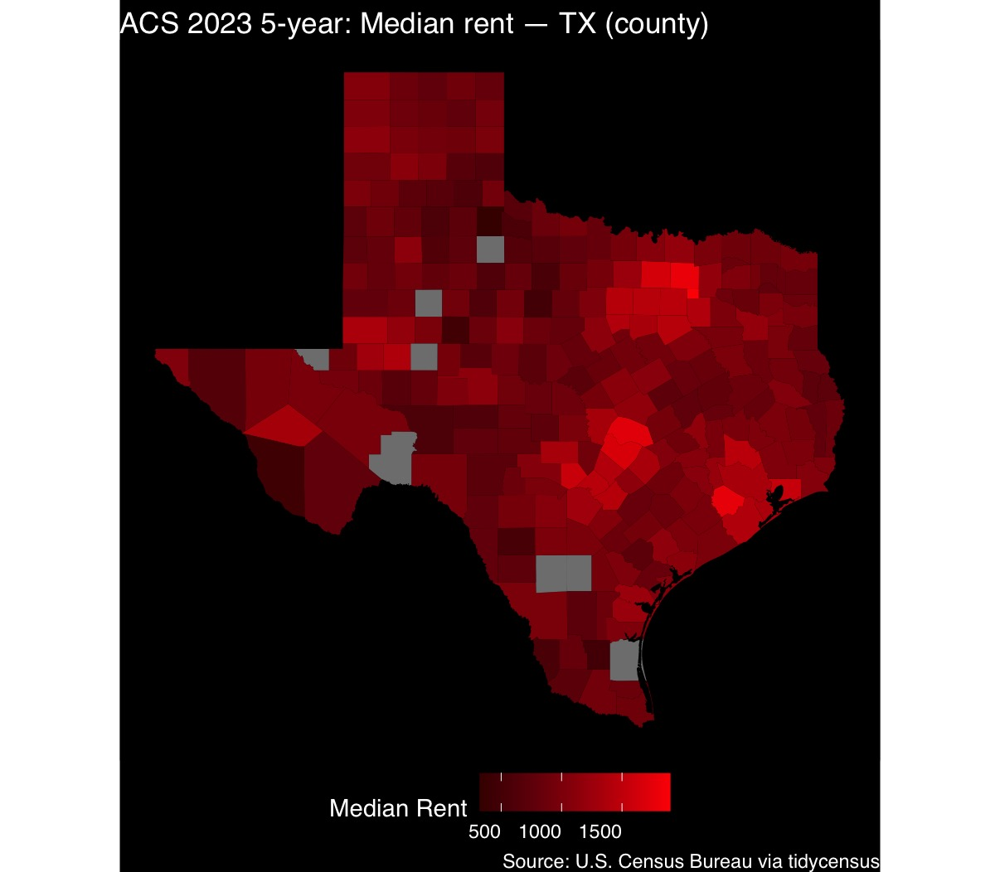

Choropleth Map:

Top 10 Counties shown below are all primarily suburbs, most are surrounding Dallas County such as Rockwall County that has an estimate median rent of \$1,899, this usually to attract high income residents, but the Margin of Error (MOE) median rent for Rockwall is high at \$108 in difference compare to Collin County who is another suburb and neighbors Rockwall, Collin has estimate median rent of \$1,792 but the MOE is \$16 which suggests that there is higher degree of confidence in the estimate compare to Rockwall and suggests that the Collin's estimate is more reliable than Rockwall's.

Top 10 Counties Table:

| Name                     | Estimate Median Rent | Moe Median Rent |
|--------------------------|----------------------|-----------------|
| Rockwall County, Texas   | 1899                 | 108             |
| Collin County, Texas     | 1792                 | 16              |
| Fort Bend County, Texas  | 1770                 | 33              |
| Willamson County, Texas  | 1720                 | 23              |
| Travis County, Texas     | 1669                 | 12              |
| Denton County, Texas     | 1642                 | 21              |
| Kendall County, Texas    | 1576                 | 97              |
| Chambers County, Texas   | 1548                 | 163             |
| Montgomery County, Texas | 1471                 | 24              |
| Dallas County, Texas     | 1469                 | 8               |

Bottom 10 Counties have lower significant rents because they are in more remote, rural areas with lower populations which could explain Cottle County's estimate median rent of \$323. The table shows that most of the counties MOE is high and therefore an unreliable rent estimate which could be explained because they had smaller sample size because low populations in this counties.

Bottom 10 Counties Table:

| Name                       | Estimate Median Rent | Moe Median Rent |
|----------------------------|----------------------|-----------------|
| Cottle County, Texas       | 323                  | 154             |
| Presidio County, Texas     | 445                  | 51              |
| Mitchell County, Texas     | 481                  | 285             |
| Shackelford County, Texas  | 485                  | 296             |
| Brooks County, Texas       | 487                  | 171             |
| Zavala County, Texas       | 544                  | 176             |
| Throckmorton County, Texas | 548                  | 405             |
| Zapata County, Texas       | 569                  | 23              |
| Foard County, Texas        | 577                  | 14              |
| Crockett County, Texas     | 585                  | 154             |
